# API Plataforma de Adoção de Gatos

API RESTful para gerenciamento de catálogo de animais e processo de triagem de adoção, desenvolvida para a disciplina de **Serviços Web** — IFSUL Campus Passo Fundo.

---

## Descrição do Domínio

Uma ONG de proteção animal precisa gerenciar um catálogo de gatos disponíveis para adoção e conduzir o processo de triagem dos adotantes. O sistema permite que qualquer pessoa visualize os gatos disponíveis; adotantes autenticados podem abrir pedidos de adoção; e a equipe da ONG pode aprovar ou rejeitar pedidos, com atualização automática do status dos animais.

---

## Pré-requisitos

- **Node.js** >= 18.0.0
- **PostgreSQL** >= 13
- **npm** >= 9

---

## Passo a Passo para Execução

### 1. Clonar o repositório

```bash
git clone <URL_DO_REPOSITORIO>
cd api-adocao-gatos
```

### 2. Configurar variáveis de ambiente

```bash
cp .env.example .env
```

Edite o arquivo `.env` com suas credenciais do PostgreSQL:

```env
PORT=3000
DB_HOST=localhost
DB_PORT=5432
DB_NAME=adocao_gatos
DB_USER=postgres
DB_PASS=sua_senha_aqui
JWT_SECRET=troque_por_uma_chave_secreta_forte
JWT_EXPIRES_IN=7d
NODE_ENV=development
```

### 3. Criar o banco de dados

```bash
createdb adocao_gatos
```

Ou via psql:

```sql
CREATE DATABASE adocao_gatos;
```

### 4. Instalar dependências

```bash
npm install
```

### 5. Popular o banco com dados de exemplo

```bash
npm run seed
```

Cria **5 gatos** e **1 usuário padrão**:
- E-mail: `admin@adocao.com`
- Senha: `senha123`

### 6. Iniciar o servidor

```bash
# Produção
npm start

# Desenvolvimento (hot-reload)
npm run dev
```

O servidor estará disponível em `http://localhost:3000`.

---

## Documentação Swagger UI

Acesse a documentação interativa em:

```
http://localhost:3000/api-docs
```

---

## Tabela de Rotas

| Método | Rota | Auth | Descrição | Status Codes |
|--------|------|------|-----------|--------------|
| GET | `/api/gatos` | Não | Lista todos os gatos (suporta `?status=`) | 200, 400, 500 |
| GET | `/api/gatos/:id` | Não | Detalhes de um gato | 200, 404, 500 |
| POST | `/api/gatos` | Sim | Cadastra novo gato | 201, 400, 401, 500 |
| PUT | `/api/gatos/:id` | Sim | Atualiza dados de um gato | 200, 401, 404, 500 |
| DELETE | `/api/gatos/:id` | Sim | Remove um gato | 200, 401, 404, 500 |
| POST | `/api/auth/register` | Não | Cadastro de adotante | 201, 400, 409, 500 |
| POST | `/api/auth/login` | Não | Login — retorna JWT | 200, 400, 401, 500 |
| POST | `/api/pedidos-adocao` | Sim | Cria pedido de adoção | 201, 400, 401, 404, 409, 500 |
| GET | `/api/pedidos-adocao` | Sim | Lista todos os pedidos | 200, 401, 500 |
| GET | `/api/pedidos-adocao/meus` | Sim | Lista pedidos do usuário autenticado | 200, 401, 500 |
| PATCH | `/api/pedidos-adocao/:id/status` | Sim | Atualiza status do pedido | 200, 400, 401, 404, 409, 500 |

---

## Testes e Validação

### Ferramenta utilizada

**Postman** — cliente REST para criação e execução de requisições HTTP. Permite organizar endpoints em coleções, definir variáveis de ambiente (ex.: `baseUrl`, `token`) e visualizar respostas formatadas em JSON, facilitando a validação manual de todos os fluxos da API.

---

### Evidências de Teste

#### POST /api/auth/register — Registrar adotante

Register com campos obrigatórios ausentes
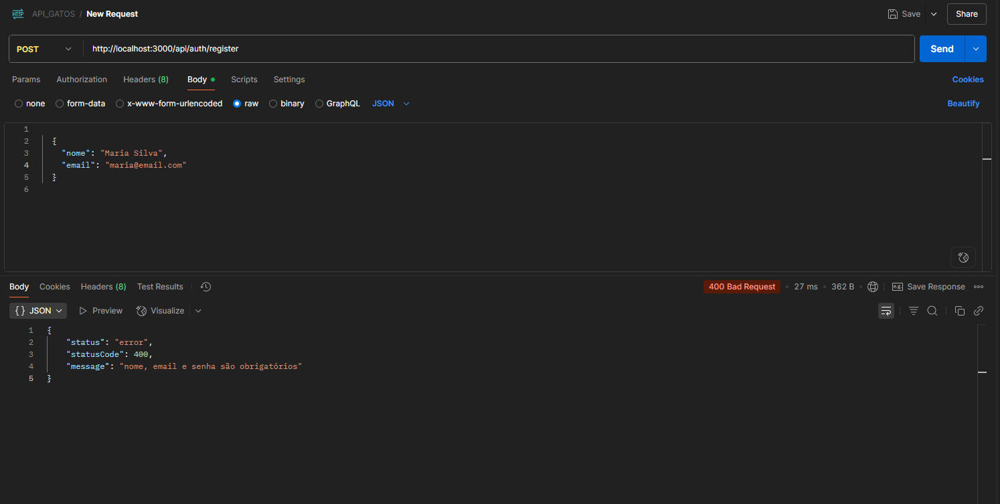

Register com e-mail já cadastrado
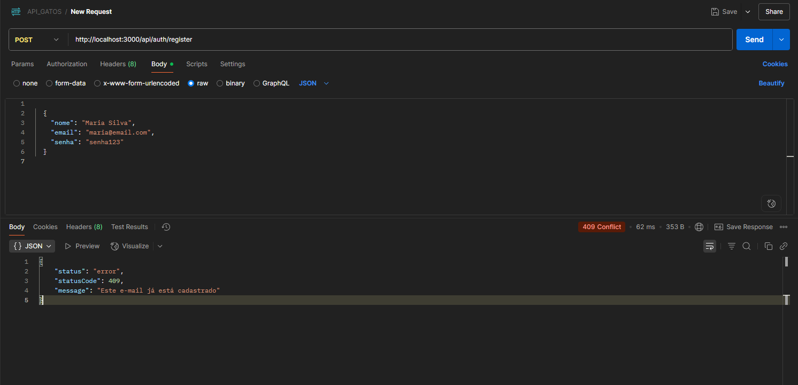

Register com sucesso
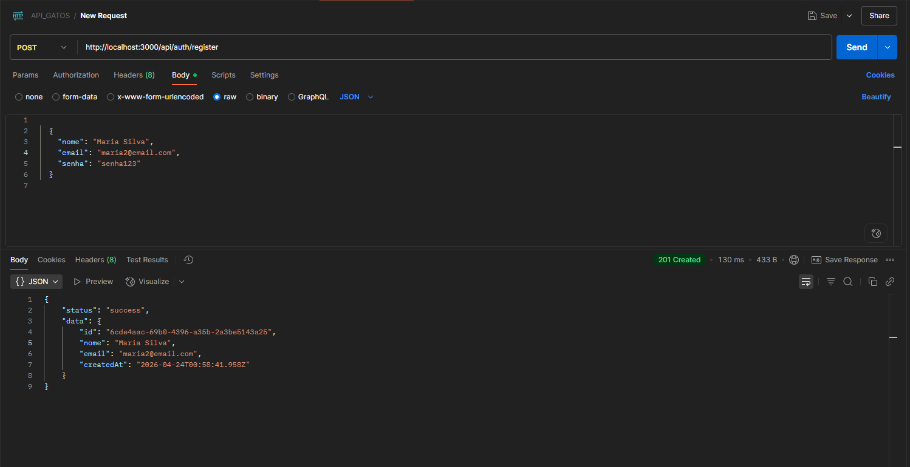

---

#### POST /api/auth/login — Login e obtenção do JWT

Login com credenciais inválidas
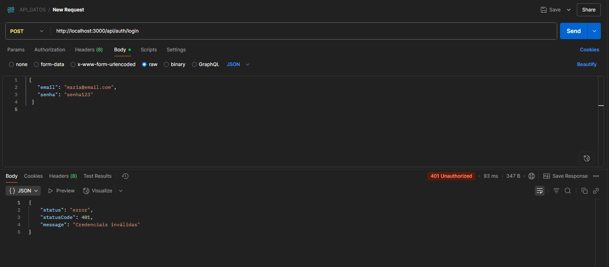

Login com sucesso retornando token JWT
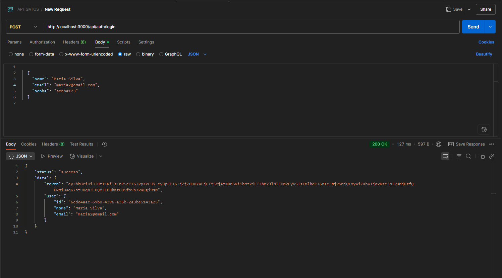

---

#### GET /api/gatos — Listar gatos

Listagem sem filtro retornando todos os gatos
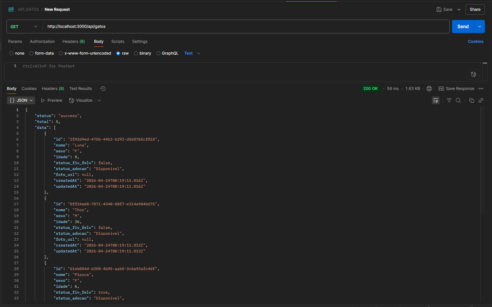

---

#### GET /api/gatos/:id — Buscar gato por ID

Busca com ID inexistente retornando 404
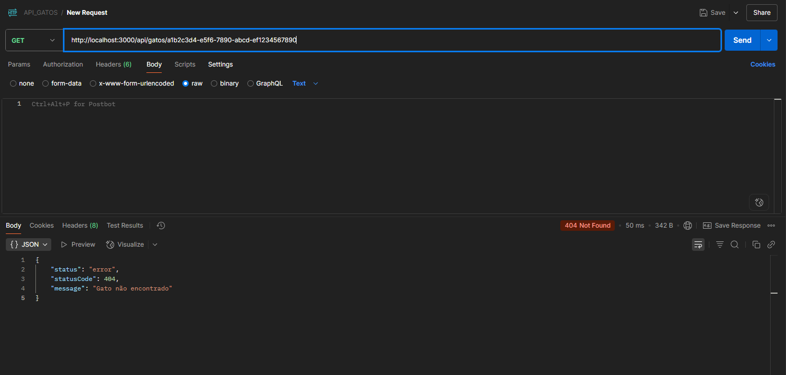

Busca com sucesso retornando detalhes do gato
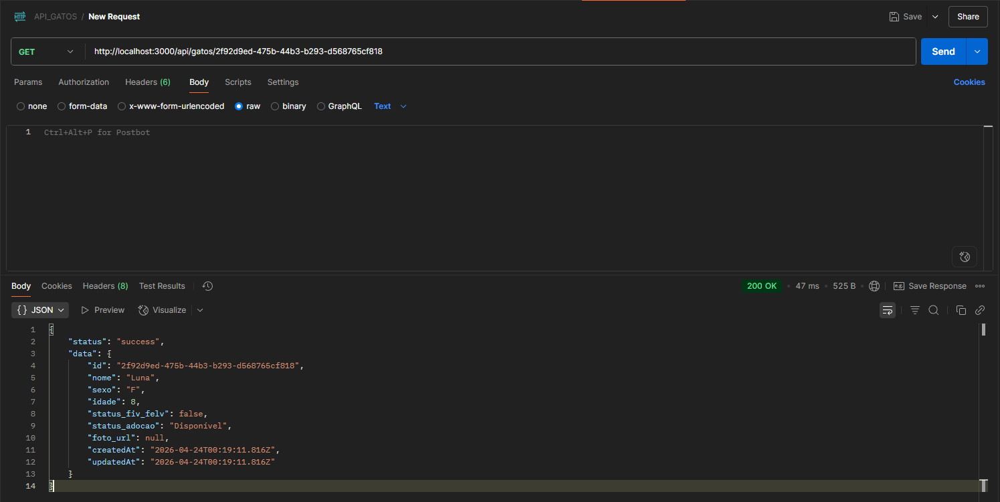

---

#### POST /api/gatos — Cadastrar gato

Tentativa sem token retornando 401
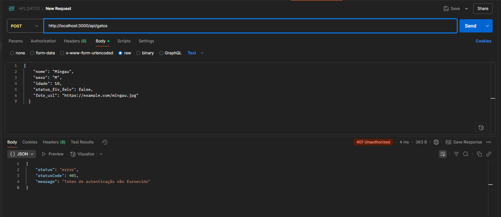

Cadastro com sucesso
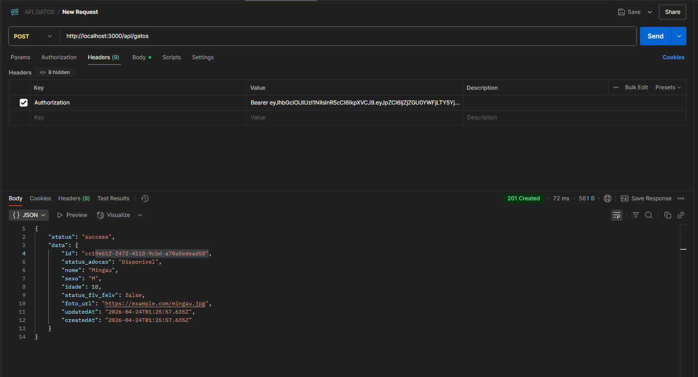

---

#### PUT /api/gatos/:id — Atualizar gato

Atualização dos dados do gato pelo ID
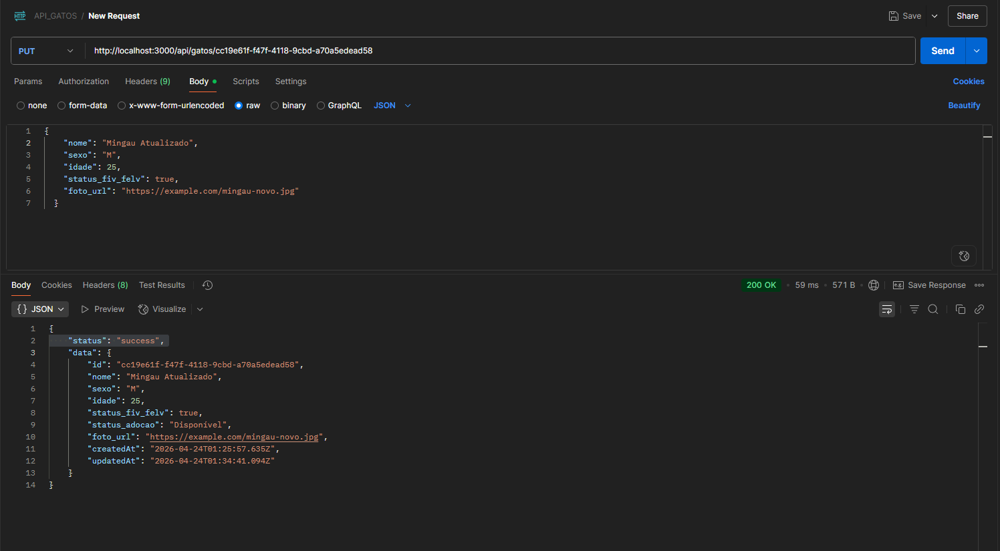

---

#### DELETE /api/gatos/:id — Remover gato

Remoção do gato pelo ID
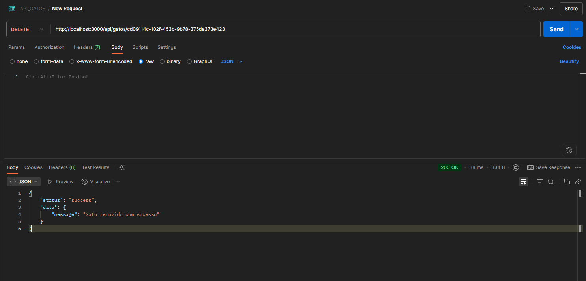

---

## Regras de Negócio

1. Só é possível criar pedido para gato com `status_adocao = 'Disponível'`; ao criar, o status muda para `'Em Análise'`.
2. `termos_aceitos` deve ser `true` — pedidos com `false` ou campo ausente retornam 400.
3. Ao aprovar um pedido: gato → `'Adotado'`; demais pedidos pendentes para o mesmo gato → `'Rejeitado'`.
4. `senha_hash` nunca é retornada em nenhuma resposta da API.
5. Um adotante não pode abrir dois pedidos para o mesmo gato.

---

## Contextualização Tecnológica

### Express.js

O **Express** é o framework web mais utilizado para Node.js, com ecossistema maduro, documentação extensa e alto desempenho para APIs RESTful de médio porte. Sua filosofia minimalista permite controle granular sobre middlewares e roteamento.

### Sequelize

O **Sequelize** é um ORM maduro para Node.js com suporte a PostgreSQL, MySQL, SQLite e MSSQL. Oferece migrações, associações, validações e hooks, reduzindo drasticamente o SQL manual.

### JWT

O **JSON Web Token** é stateless — o servidor não precisa armazenar sessões. Ideal para APIs RESTful e arquiteturas distribuídas. O token carrega o payload criptografado, eliminando consulta ao banco a cada request autenticado.

### PostgreSQL

O **PostgreSQL** é um banco relacional robusto, com suporte nativo a UUIDs, arrays (usado em `links_comprovantes`), ENUMs, JSONB e transações ACID. A consistência relacional é essencial para o modelo de dados com FKs entre Gato, User e PedidoAdocao.

---

## Estrutura do Projeto

```
src/
├── config/
│   ├── database.js        # Configuração do Sequelize + PostgreSQL
│   └── swagger.js         # Configuração do Swagger UI
├── controllers/           # Entrada/saída HTTP, validação básica
│   ├── AuthController.js
│   ├── GatoController.js
│   └── PedidoAdocaoController.js
├── middlewares/
│   ├── authMiddleware.js  # Validação de Bearer JWT
│   └── errorHandler.js    # Handler centralizado + classe ApiError
├── models/                # Modelos Sequelize + associações
│   ├── index.js
│   ├── Gato.js
│   ├── User.js
│   └── PedidoAdocao.js
├── repositories/          # Acesso ao banco via Sequelize (DAO)
│   ├── GatoRepository.js
│   ├── UserRepository.js
│   └── PedidoAdocaoRepository.js
├── routes/                # Definição de endpoints
│   ├── index.js
│   ├── auth.js
│   ├── gatos.js
│   └── pedidosAdocao.js
├── seeders/
│   └── seed.js            # Dados iniciais de exemplo
├── services/              # Regras de negócio
│   ├── AuthService.js
│   ├── GatoService.js
│   └── PedidoAdocaoService.js
├── app.js                 # Configuração do Express
└── server.js              # Ponto de entrada
swagger/
└── openapi.yaml           # Documentação OpenAPI 3.0
```
